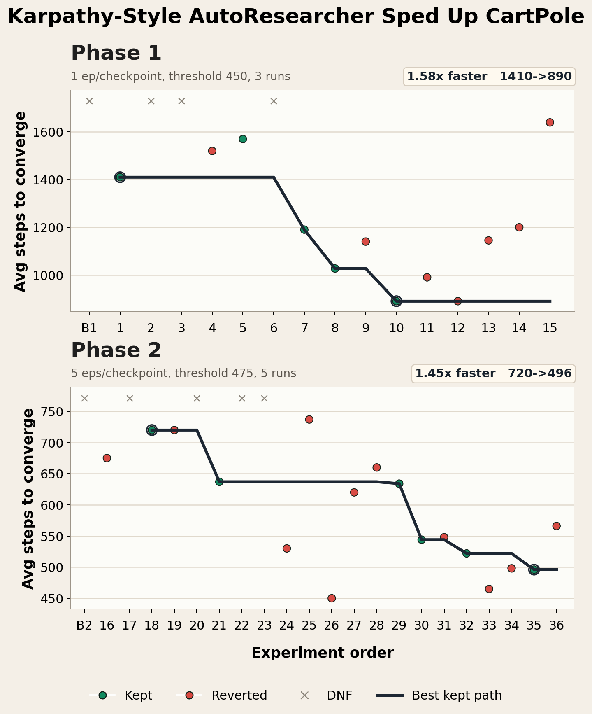
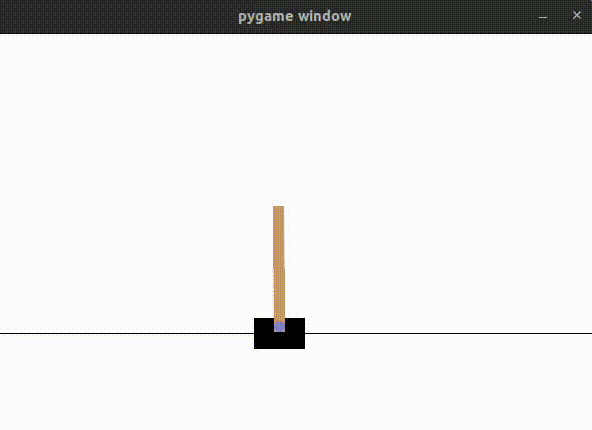

# Agentic Auto-research for an RL experiment

Years ago, I made this CartPole agent and tuned it by hand. I thought it was optimal. Then I gave the codebase to Claude (strategist) and Codex (implementer) and told them to make it learn faster. They ran 36 experiments on their own. No human touched the code. No human picked the hyperparameters.

They took my "optimal" agent and made it converge 3x faster, then made it perfectly reliable on a harder eval that my version couldn't even pass.

The part that surprised me: when blind tuning stopped working, they stopped tuning and started diagnosing. They read the training logs, traced the failures to weight initialization variance, and fixed it in one shot. That single insight turned a 60% failure rate into 100% reliability.



## Karpathy's autoresearch

This project is directly inspired by Karpathy's [autoresearch](https://github.com/karpathy/autoresearch) repo. His setup: give an AI agent a small LLM training codebase, a fixed 5-minute time budget, and one metric to optimize. The agent modifies the code, trains, checks if the result improved, keeps or discards, and repeats. You wake up to a log of experiments and a better model.

I took that idea and ran with it in a different direction. Instead of LLM training, I pointed it at reinforcement learning (CartPole). Instead of one agent editing one file, I split it into two: Claude as the strategist proposing experiments, Codex as the coder implementing them. And instead of just "try stuff and keep what works," the agents follow a proper scientific method: hypothesize, implement, measure across multiple runs (RL is noisy), keep or revert, log the lesson, repeat.

The core loop is the same as Karpathy's. The difference is that mine has to deal with RL's variance problem (you need multiple runs to know if something actually worked) and it builds up a structured experiment history that feeds into future hypotheses.



## What actually happened

**Phase 1** started with a barely-functional agent. Over 15 experiments the AIs found the right network size, discount factor, batch size, and replay buffer config. Convergence went from impossible to ~890 steps.

Then I made the test much harder: 5 evaluation episodes instead of 1, higher passing threshold, more runs required. The optimized Phase 1 agent immediately went back to DNF.

**Phase 2** required real breakthroughs. The AIs stacked dueling networks, layer normalization, and an aggressive learning rate to get the first convergences. But reliability was stuck at 60%. Eight straight experiments failed to improve it.

That's when the diagnosis happened. Instead of trying experiment #9, the AI read the training logs of a failed run, noticed the collapse pattern, and proposed orthogonal initialization with small policy output gains. One experiment: 60% to 100% reliability. After that, previously-failed ideas like n-step returns suddenly worked, and convergence dropped from 634 to 496 steps.

## The experiment log

Every experiment, outcome, and lesson: [codex/results.tsv](codex/results.tsv)

Highlights from 36 experiments:
- **13 kept, 23 reverted.** Most ideas don't work, and that's fine.
- **Fastest single run**: 420 steps (but unreliable, so it was reverted)
- **Best config**: 496 avg steps, 5/5 convergence, zero failures
- **Biggest breakthrough**: orthogonal init (exp29). Fixed the root cause, not the symptoms.

## Running it

```bash
source /home/nick/rl-env/bin/activate
python cartpole.py --max-seconds 300 --log-dir logs/dev_run
```

## Under the hood

The final agent stacks several techniques from deep RL research:

- Soft Actor-Critic (discrete) with automatic entropy tuning
- Dueling Q-networks with layer normalization
- Orthogonal initialization (gain=1.414 for ReLU, 0.01 for policy head)
- 5-step returns for faster credit assignment
- Prioritized experience replay (GPU-accelerated)
- 64 parallel environments, vectorized evaluation

The orchestration protocol: [codex/program.md](codex/program.md)

## Repo structure

- `cartpole.py`: training loop and evaluation scheduling
- `SACAgent.py`: the SAC agent with dueling Q-nets
- `evaluation_worker.py`: parallel evaluation in a subprocess
- `TFPrioritizedReplayBuffer.py` / `sumtree.py`: prioritized replay
- `TrainingLogger.py`: structured logging (JSONL, CSV, PNG)
- `codex/`: experiment specs, results log, and orchestration protocol
