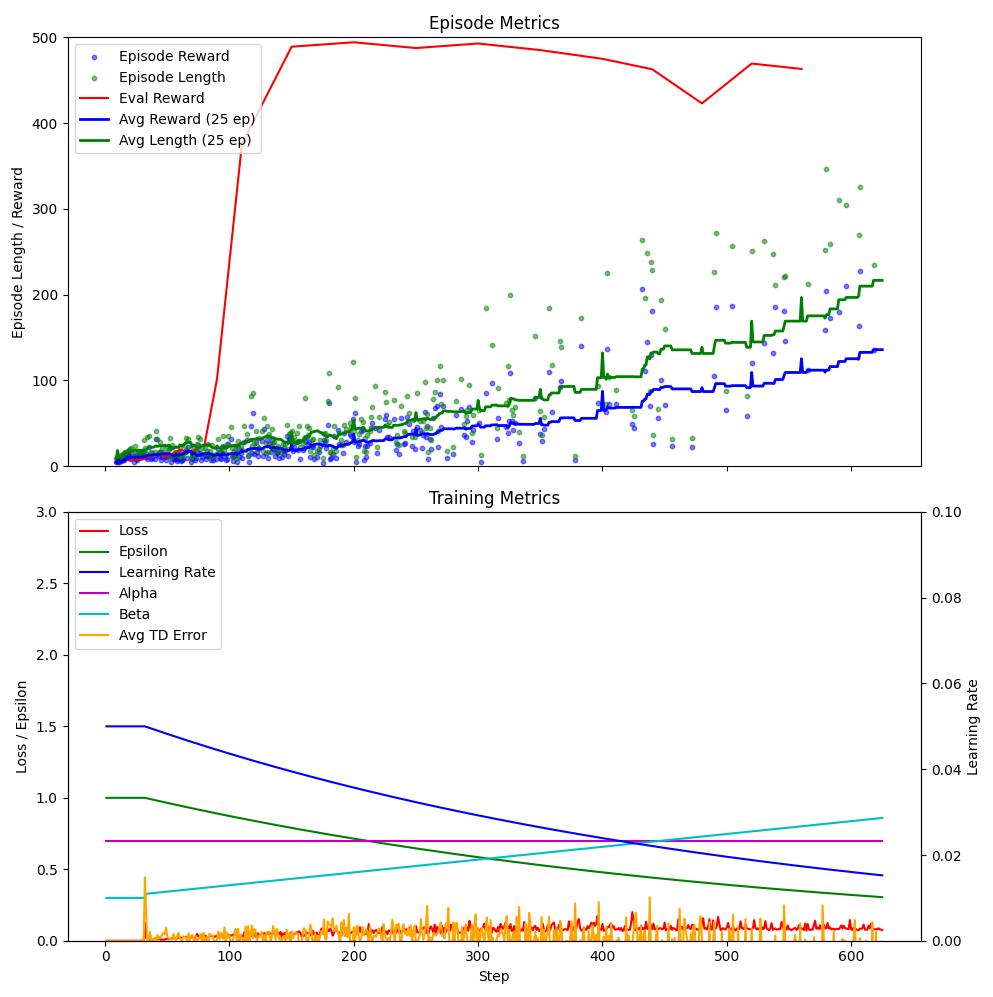

# Ultra-Fast CartPole-v1 Solution

A heavily optimized Deep Double Q-Network implementation that solves CartPole-v1 in under 60 seconds using custom GPU-accelerated data structures, vectorized environments, and advanced TensorFlow optimization.

*To my knowledge, this is the fastest CartPole training implementation available. If you're aware of a faster one, I'd genuinely love to see it.*

## Performance Overview


*Training plots showing rapid convergence*

<video width="400" controls>
  <source src="media/cartpole_demo.webm" type="video/webm">
  Your browser does not support the video tag.
</video>
*Trained agent balancing the pole*

Typically, cartpole is considered "solved" when the rolling average episode score is >195. My implementation defines it as continuously scoring a perfect 500 on evaluation episodes (no epsilon)

**Key Metrics:**
- **Training time**: <60 seconds (This includes all TensorFlow initialization!)
- **Parallelization**: 64 vectorized environments
- **GPU acceleration**: Custom Tensor-accelerated training loop and SumTree implementation with 5x+ sampling speedup
- **Throughput**: 10M+ timesteps efficiently processed

## Technical Architecture

### GPU-Accelerated Prioritized Replay
The core innovation is a custom **TensorFlow-native SumTree** implementation for prioritized experience replay:

- **Three-tier optimization**: Pure Python → NumPy vectorization for building/rebuilding tree → TensorFlow GPU-accelerated parallel tree access
- **Vectorized tree traversal**: Batch sampling using TensorFlow operations are O(log(n)), 5x faster and scalable
- **Smart rebuilds**: Partial tree reconstruction occurs after a batch-add to minimize overhead
- **Memory efficiency**: Float32 precision with strategic memory layouts. Indexes are shared across all data tensors 

The SumTree implementation alone represents a significant algorithmic contribution, achieving >5x sampling performance improvements through vectorized TensorFlow operations while maintaining mathematical correctness.

### Vectorized Environment Processing
- **TFWrappedVecEnv**: Minimizes costly TensorFlow-NumPy conversions
- **64 parallel environments**: Maximizes CPU utilization
- **Batched operations**: Actions, rewards, and state transitions processed in parallel on GPU

### Advanced DQN Implementation
- **Double DQN**: Separate target networks with soft target updates
- **Epsilon and learning rate decay**: balances exploration and exploitation throughout the learning process
- **Custom rewards**: Reward varies continuously from 1 to 0 depending on cart angle and position. This provides better gradients than the standard cartpole reward system
- **Mixed precision**: RTX 3090 optimization with gradient scaling
- **Gradient clipping**: Huber loss with configurable delta for stability

## Performance Engineering

**Memory Optimization:**
- Strategic GPU memory growth configuration
- Efficient batch processing (1024 samples). Larger batches train faster but require more env steps to gather initial training data. I've found 1024 to be the sweet-spot
- Real-time memory usage monitoring

**Profiling Integration:**
- Built-in cProfile for bottleneck identification
- Comprehensive timing analysis of training loop components

**Neural Architecture:**
- Compact 12→12→2 network for minimal computational overhead. Network forward passes and backpropogation run on a custom training loop on GPU
- Optimized hyperparameters: γ=0.998, τ=0.06, α=0.7. This is extremely aggressive for Q learning generally but works great for this simple environment. 

## Usage

```bash
# Quick start
./run_cartpole_training.sh

# With custom parameters
python cartpole.py --log-dir="experiment_1" --graphics
```

Training automatically generates:
- Real-time performance visualizations
- Model checkpoints with evaluation metrics
- Comprehensive logging and profiling data
- Backups of scripts so you know what you changed!


## Hardware Requirements

- NVIDIA GPU with CUDA support (tested on RTX 3090)
- 8GB+ system RAM
- TensorFlow 2.x with GPU support

## Dependencies

```
gymnasium tensorflow numpy matplotlib pandas psutil
```

---

*This represents the fastest CartPole training implementation I'm aware of. The sub-60-second timing includes full TensorFlow initialization, model compilation, and training to convergence. I'd be interested to see any faster implementations that exist.*
